# Murmelbahn

This repository contains OpenSCAD code for the 3D-printing of
- tiles
- rails
- elements,

which together can be assembled to form a marble run.

Common marble run elements can be obtained via the Gravitrax sets. Items available in Gravitrax boxes are not included here.

## Tiles
The basic composition element is the hexagonal tile. Tiles have **runways**, which connect **entry points** 0-5.
Runways have **geometries**. A straight alley connecting position 0 with position 3 has the geometry "I". An wide curve connecting 0 with 2 has the geometry "C". A narrow curve connecting 0 with 1 has the geometry "c". Various combinations exist.

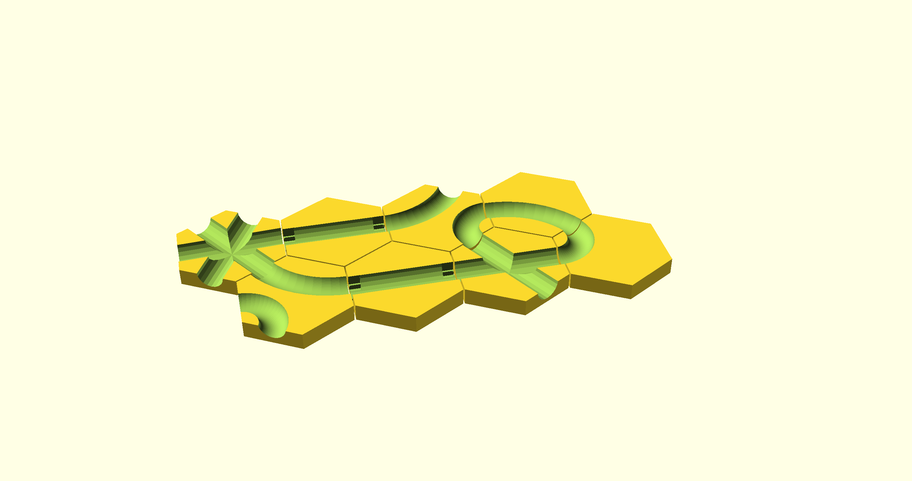

- * 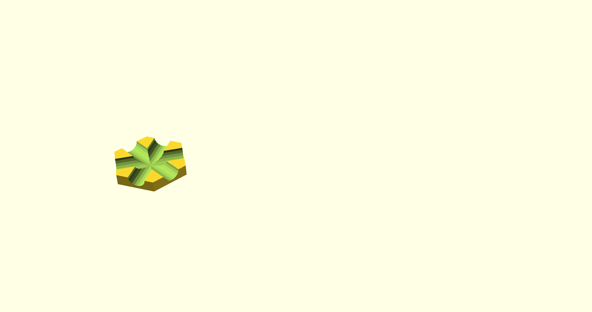
- I 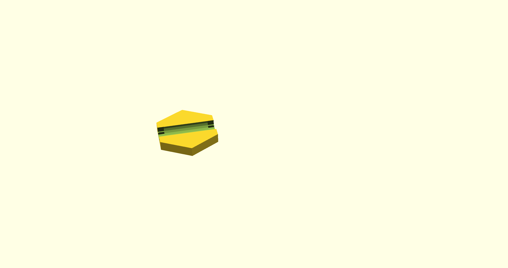
- c 
- C 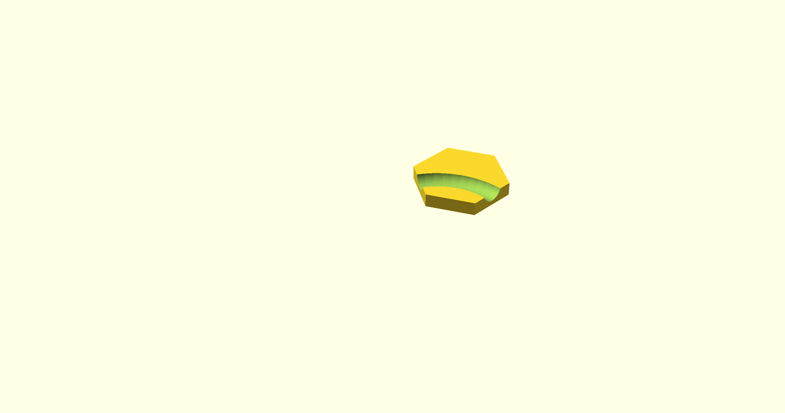
- cC 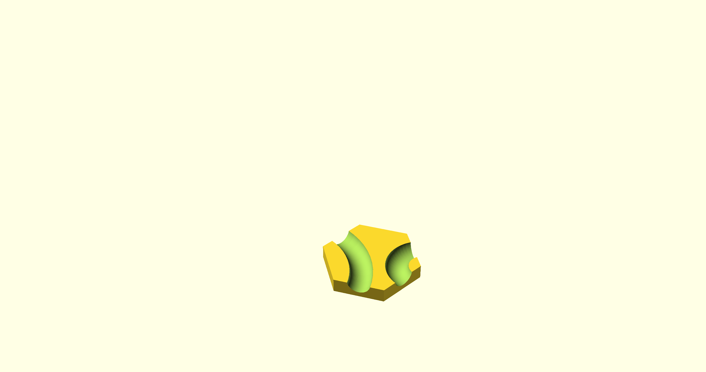
- Cc 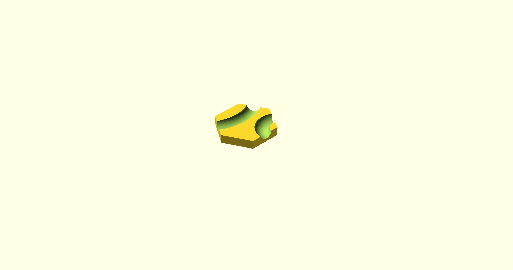
- X 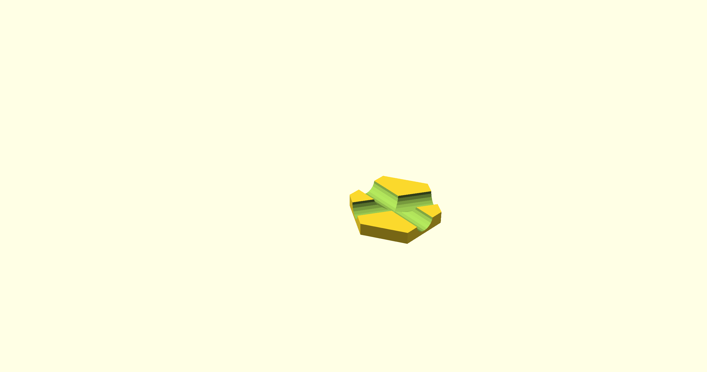

## Rails
Rails connect tiles across areas where there are no tiles. Gravitrax sells straight rails of lenghts 1, 2, and 3.
Here, files are provided for rails of lenghts 4 and 5, as well as for curved rails and straight rails with curves at one or both entry points.

- straight rail 4
- straight rail 5

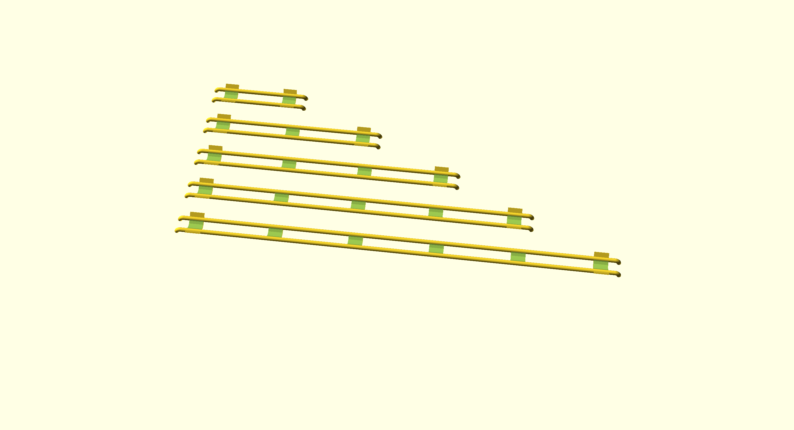

- wide curve
- narrow curve
- S-curve
- Z-curve

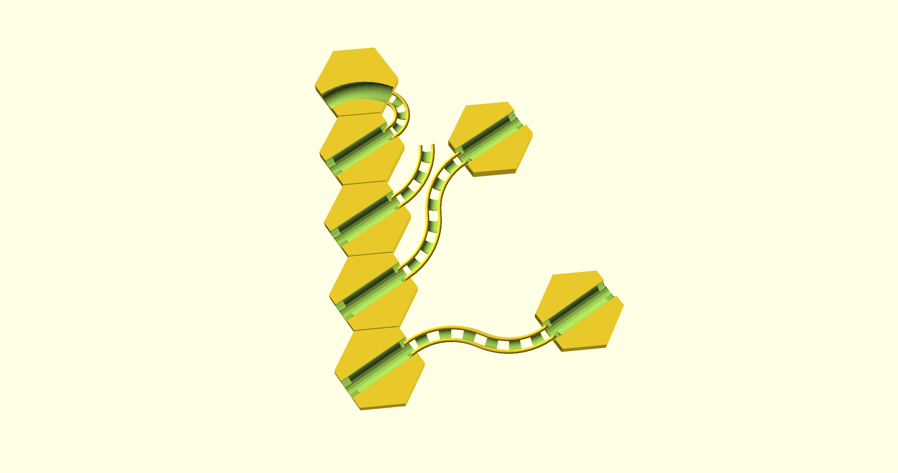

- rail 1 with right curve
- rail 1 with left curve
- rail 1 S-curve
- rail 1 Z-curve

- rail 2 with right curve
- rail 2 with left curve
- rail 2 S-curve
- rail 2 Z-curve

- rail 3 with right curve
- rail 3 with left curve
- rail 3 S-curve
- rail 3 Z-curve

- rail 4 with right curve
- rail 4 with left curve
- rail 4 S-curve
- rail 4 Z  -curve

## Elements
### looping
#### 180°
#### 120°

### funnel
#### large
#### small

### chest
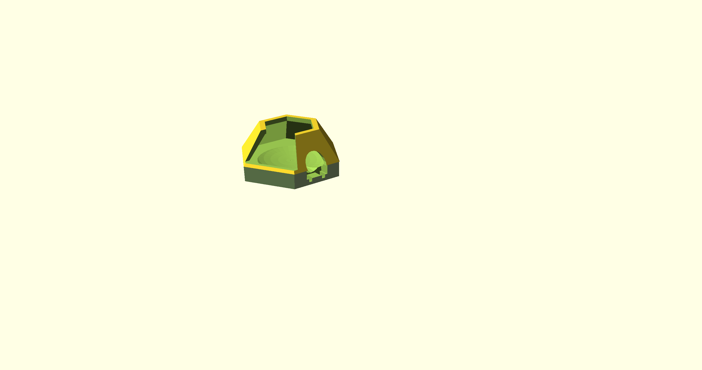

### coil
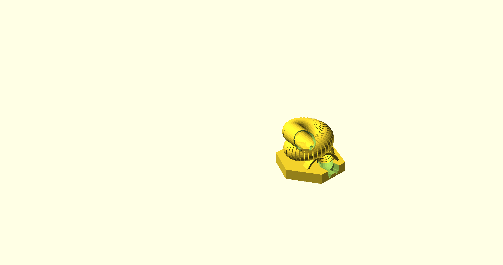

